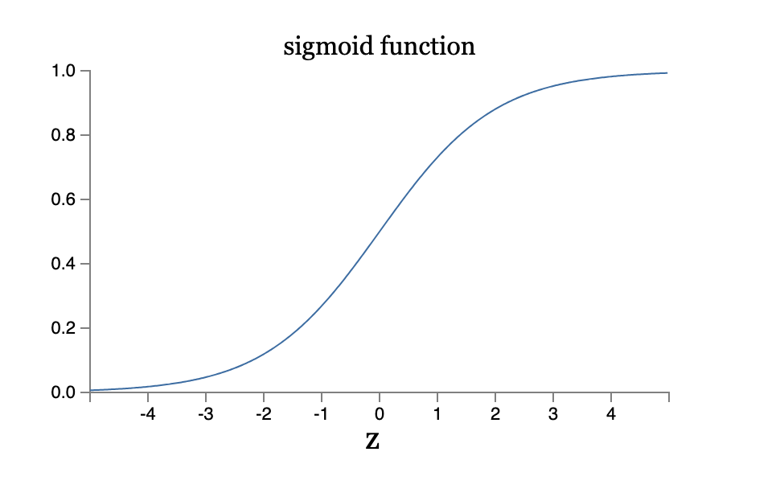

## Rough Ideas
inspired by the brain.

*Neuron* : a thing that holds a number
"Activation"

*Layers*
"Hidden layers"

<u>How it operates:</u>
Activations in one layer determines the activation of another layer

Weights

Signoid function (squeezes output between 0 and 1)

Bias: for inactivate; ( how high the weights need to be before the outputs become meaninglessly active)

**Network** -> function

## Perceptrons

- Type of artificial neuron
- Takes several binary inputs $x_1, x_2, x_3, \ldots$ and produces a single binary outputs
- **Weights**: expresses the importance of the respective inputs to the output
- Neuron's output: - determined by the weighted sum $\sum_jw_jx_j$ less than or greater than some **threshold value**

By varing the weights and the threshold -> different models of decision-making

SImplify the way of describing perceptions:
- write $\sum_jw_jx_j = w \dot x$.
- **bias**: -threshold

We can implement all logic gates with perceptrons.

Reassuring: perceptrons can be as powerful as any other computing device
Disappointing: merely a new type of NAND gate.

It's better.
We can devise **learning algorithms** which can automatically tune the weights and biases of a network of artificial neurons.

## Sigmoid neurons
- similar to perceptrons
- modified so that small changes in their weights and bias cause only small changes in their output
- inputs can take any values between 0 and 1
- output is $\sigma(w \dot x + b)$
- $\sigma$ is the sigmoid function: $\sigma(z) = \frac{1}{1 + e^{-z}}$

The smoothness of $\sigma$ means that small changes $\Delta w_j$ in the weights and $\Delta b$ in the bias will produce a small change $\Delta \text{output}$ in the output from the neuron. In fact, calculus tells us that $\Delta \text{output}$ is well approximated by
$$
\Delta \text{output} \approx \sum_j \left( \frac{\partial \text{output}}{\partial w_j} \right) \Delta w_j + \left( \frac{\partial \text{output}}{\partial b} \right) \Delta b
$$

**Feedforward**: no loops in the network
Opposite is **recurrent neural networks**

Recurrent neural nets have been less influential than feedforward networks, in part because the learning algorithms for recurrent nets are (at least to date) less powerful. But recurrent networks are still extremely interesting. They're much closer in spirit to how our brains work than feedforward networks. And it's possible that recurrent networks can solve important problems which can only be solved with great difficulty by feedforward networks.   
